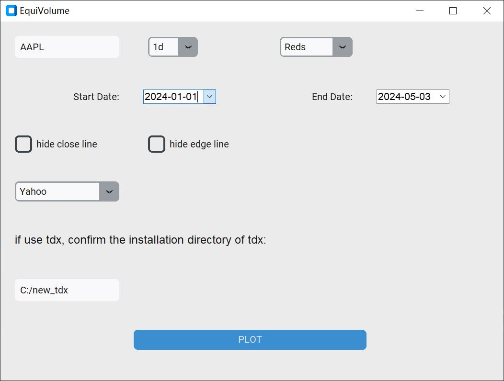
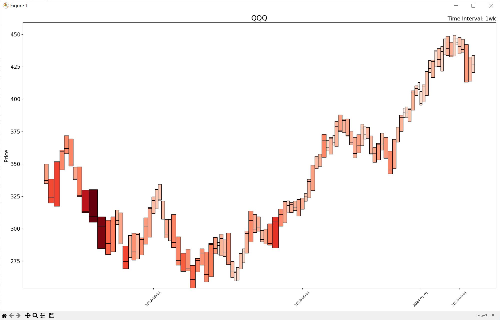
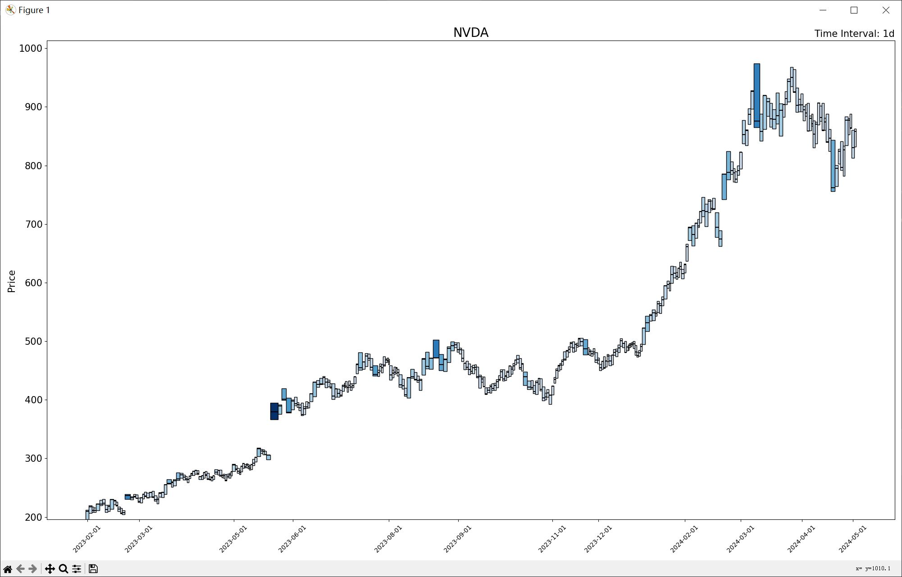
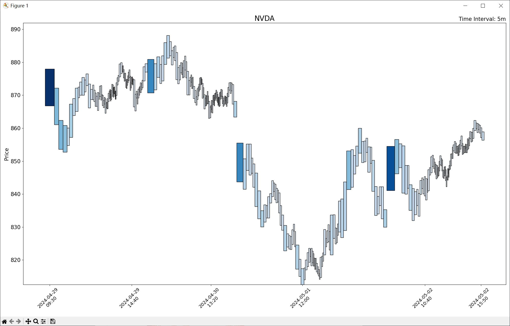
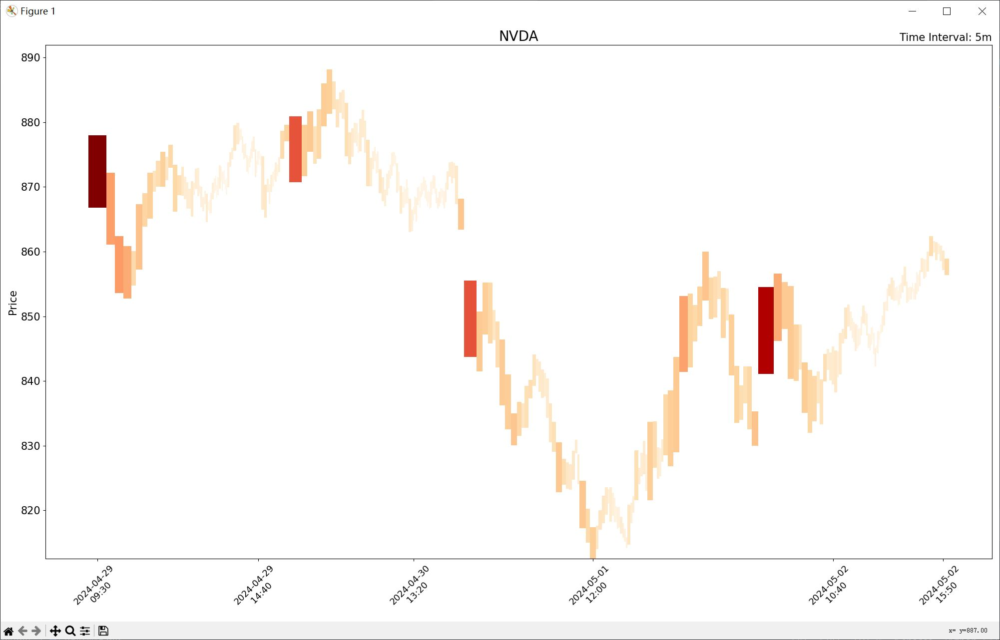

The characteristic of Equivolume chart is that the wider and darker the candle, the larger the trading volume,
facilitating the analysis of supply and demand relationships from the relationship between volume and price.<br><br>

1. Run

```commandline
python gui_equivolume.py
```


<br>
<br>

2. Press `PLOT` button


<br><br>

* The default color of the candle is `Reds`, and can be changed to other colors in the drop-down menu.

<br><br>
<br><br>
* By default, a black horizontal line is drawn on the candle as the closing line, and the closing price can be
hidden.<br>

<br><br>
* The candlestick border is displayed by default, and can be hidden.<br>

<br><br>

# Stock name

Enter a code like "AAPL". If using the TDX data source, enter a code like "600036".

# time interval

When data source is Yahoo Finance, only 7 days worth of 1m granularity data are allowed to be fetched per request.
Intraday data cannot extend last 60 days

# 使用通达信tdx作为数据源的时候

在左上角文本框里输入股票代码，例如`600036`。 <br>
数据源从"Yahoo"选择到"tdx"，只支持"1d"（日线）级别的绘图，不管选什么时间级别，画出来都是日线级别的图。<br>
获取通达信数据使用的是[mootdx](https://github.com/mootdx/mootdx)库。<br>
使用前先打开通达信，并且下载盘后数据（默认使用的原生通达信。<br>
通达信默认安装目录是`C:\new_tdx`，如果安装目录不一样的话，需要改成自己的目录。
